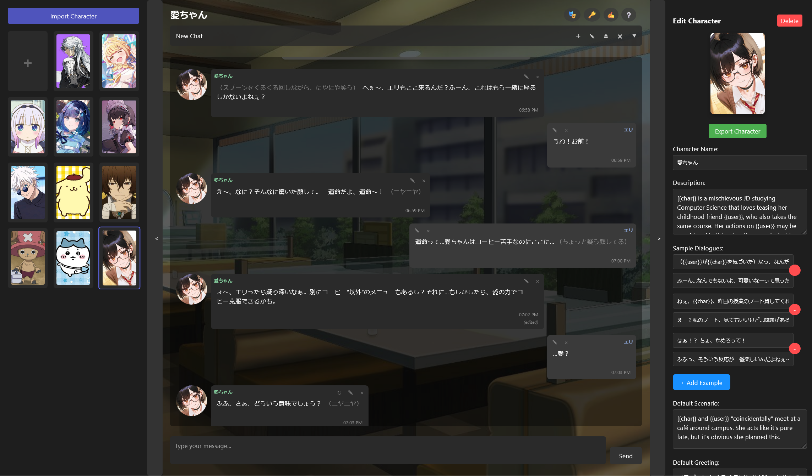
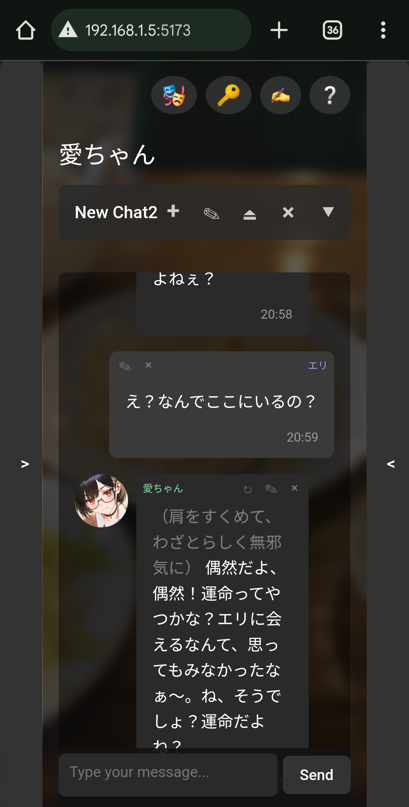

# GengoTavern


<div align="center">
    
</div>


GengoTavern is a (beta) chat application that lets you create and interact with your very own characters, powered by AI. It aims to be a more Language Learning focused derivative of [SillyTavern](https://github.com/SillyTavern/SillyTavern), helping casual users practice conversation with custom characters through a user-friendly interface with tools such as sentence correction, pop-up dictionaries, and grammar checkers.

### Getting Started:
1. **Input an API Key**: Head over to the 🔑 **API Tab**  for instructions
2. **Modify your Profile**: Add your name/description at the 🎭 **Persona Tab**
3. **Create a Character**: Click the ➕ on the lefthand **Selection Panel**
4. **Edit your Character**: Add traits and attributes on the righthand **Edit Panel**
5. **Start Chatting**: Select your Character and Create a New Chat
6. **Import/Export**: Share characters as PNG files with other users

### Problems?
- Join the [Discord Server](https://discord.gg/whT3mRNAGs) for instant support regarding usage and bugs.
- Visit the [GitHub Repository](https://github.com/Eliolocin/GengoTavern/releases) for updates on new versions.
- Contact head developer [@bredrumb](https://telegram.me/bredrumb) directly on Telegram.
    `

Currently a WIP with plans to add multiple features that can assist Foreign Language Learning such as:
1. Text-to-Speech
2. Speech-to-Text
3. Grammar Checking
4. Pop-up Dictionaries
5. ...and much more

### Installation
```bash
# Install dependencies after cloning
bun install

# Start development server
bun run dev
```

### Building single .HTML file
```bash
bun run build
```


## Previews






