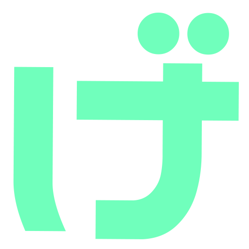
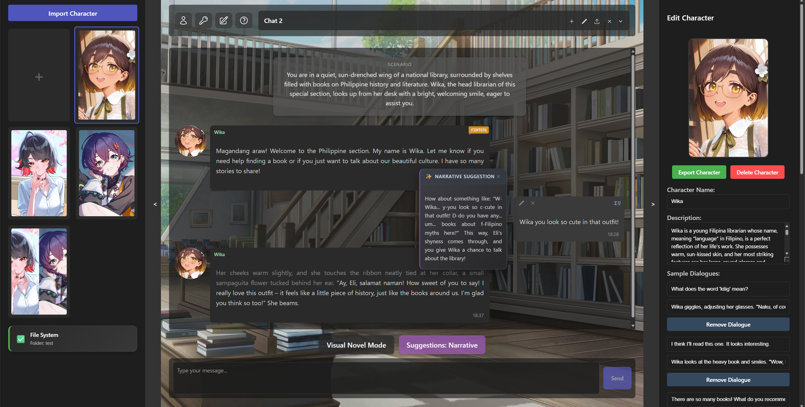
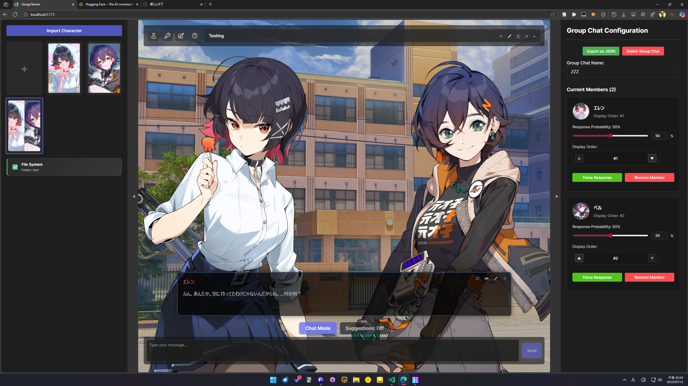
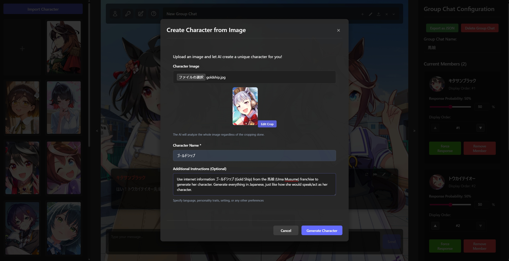
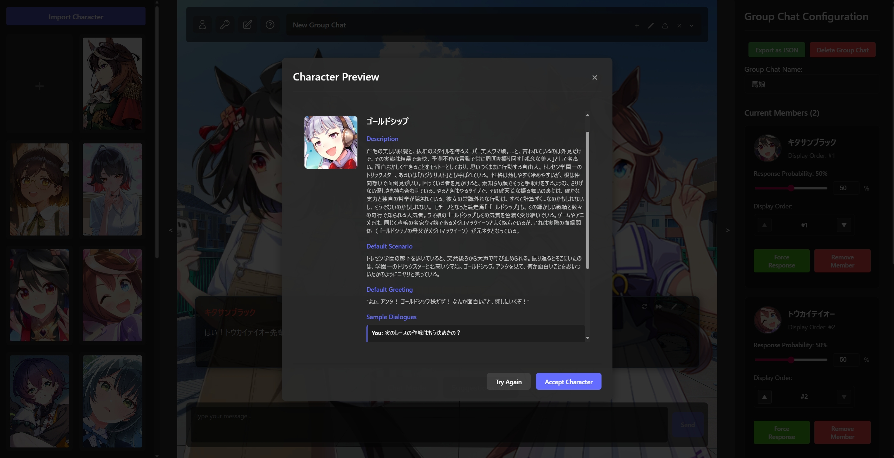

<!-- PROJECT LOGO -->
<br />
<div align="center">
  <a href="https://github.com/Eliolocin/GengoTavern">
    
  </a>

<h3 align="center">GengoTavern</h3>

  <p align="center">
    SillyTavern-inspired chat application for language learning and user-friendly roleplaying with AI chatbots
    <br />
    <a href="https://github.com/Eliolocin/GengoTavern"><strong>Explore the docs »</strong></a>
    <br />
    <br />
    <a href="https://github.com/Eliolocin/GengoTavern/issues/new?labels=bug&template=bug-report---.md">Report Bug</a>
    &middot;
    <a href="https://github.com/Eliolocin/GengoTavern/issues/new?labels=enhancement&template=feature-request---.md">Request Feature</a>
  </p>
</div>


<!-- TABLE OF CONTENTS -->
<details>
  <summary>Table of Contents</summary>
  <ol>
    <li>
      <a href="#about-the-project">About The Project</a>
      <ul>
        <li><a href="#key-features">Key Features</a></li>
        <li><a href="#built-with">Built With</a></li>
      </ul>
    </li>
    <li>
      <a href="#getting-started">Getting Started</a>
      <ul>
        <li><a href="#prerequisites">Prerequisites</a></li>
        <li><a href="#installation">Installation</a></li>
        <li><a href="#configuration">Configuration</a></li>
      </ul>
    </li>
    <li><a href="#usage">Usage</a></li>
    <li><a href="#features">Features</a></li>
    <li><a href="#screenshots">Screenshots</a></li>
    <li><a href="#roadmap">Roadmap</a></li>
    <li><a href="#contributing">Contributing</a></li>
    <li><a href="#license">License</a></li>
    <li><a href="#contact">Contact</a></li>
  </ol>
</details>

<!-- ABOUT THE PROJECT -->
## About The Project

GengoTavern is a simple ~~vibe-coded~~ chat application that enables users to create and interact with AI-powered characters for roleplay. Designed as a language learning-focused derivative of SillyTavern, it provides an intuitive interface for practicing conversation with customizable chatbots while offering features like grammar correction, visual novel modes, and group chats.

### Key Features

* 🤖 **AI-Powered Conversations**: Chat functionality using Google Gemini models
* 🎭 **Character Creation**: Create custom AI personas with unique traits, descriptions, and sample dialogues
* 🎨 **Visual Novel Mode**: Visual novel-style interface mode with character sprites and emotion detection
* 👥 **Group Chats**: Multi-character conversations with probability-based response systems
* 🖼️ **Image-to-Text Generator**: Auto-generate character profiles from reference images using AI
* 📚 **Language Learning Tools**: (WIP) Implicit grammar correction with conversational recasts and narrative suggestions
* 💾 **Advanced Storage**: Dual storage strategy supporting File System Access API and localStorage fallback
* 📤 **Import/Export**: Share characters as PNG files with embedded metadata
* 😊 **Emotion Detection**: Multilingual sentiment analysis for dynamic sprite changes

<p align="right">(<a href="#readme-top">back to top</a>)</p>


<!-- SCREENSHOTS -->
## Screenshots

### Standard Chat Interface & Implicit Correction

*Standard chat interface with character selection, customization panels, and conversation history*

### Visual Novel Mode & Group Chats

*Visual novel mode with character sprites and emotion-based presentation*

### Image-to-Text Generation


*Easily create new characters compatible with GengoTavern by uploading pictures and extra instructions*

<p align="right">(<a href="#readme-top">back to top</a>)</p>

### Built With

* [![TypeScript][TypeScript.js]][TypeScript-url]
* [![React][React.js]][React-url]
* [![Vite][Vite.js]][Vite-url]
* [![Bun][Bun.sh]][Bun-url]

<p align="right">(<a href="#readme-top">back to top</a>)</p>

<!-- GETTING STARTED -->
## Getting Started

This guide will help you set up GengoTavern locally for development or personal use.

### Prerequisites

Before running GengoTavern, ensure you have the following installed:

* **Bun** - JavaScript runtime and package manager
  ```sh
  curl -fsSL https://bun.sh/install | bash
  ```
* **Google Gemini API Key** - Required for AI functionality
  - Visit [Google AI Studio](https://makersuite.google.com/app/apikey)
  - Create a new API key for free
  - Keep it secure for configuration

### Installation

1. **Clone the repository**
   ```sh
   git clone https://github.com/Eliolocin/GengoTavern.git
   cd GengoTavern
   ```

2. **Install dependencies**
   ```sh
   bun install
   ```

3. **Start development server**
   ```sh
   bun run dev
   ```

4. **Build for production** (creates single HTML file)
   ```sh
   bun run build
   ```

### Configuration

1. **Set up your API Key**
   - Launch GengoTavern in your browser
   - Navigate to the 🔑 **API Tab**
   - Enter your Google Gemini API key
   - Select your preferred model (Gemini Pro/Flash)

2. **Configure your persona**
   - Go to the 🎭 **Persona Tab**
   - Add your name and description
   - This helps the AI understand who you are

<p align="right">(<a href="#readme-top">back to top</a>)</p>

<!-- USAGE -->
## Usage

### Quick Start Guide

1. **Create Your First Character**
   - Click the ➕ button in the **Character Selection Panel**
   - Choose from:
     - **Empty Character**: Start from scratch
     - **Character From Image**: Generate from reference image
     - **Group Chat**: Multi-character conversations

2. **Customize Your Character**
   - Use the **Character Customization Panel** to edit:
     - Name and description
     - Sample dialogues
     - Default scenario and greeting
     - Upload character sprites for Visual Novel mode

3. **Start Chatting**
   - Select your character from the left panel
   - Create a new chat session
   - Begin your conversation!

### Advanced Features

#### Visual Novel Mode
- Toggle the **VN Mode** button above the chat box
- Experience immersive visual novel-style conversations
- Character sprites change based on emotion detection
- Perfect for language learning immersion

#### Grammar Correction
Choose from three correction modes:
- **Off**: No grammar assistance
- **Implicit Feedback**: Conversational recasts (e.g., "Oh, you *like* tea!")
- **Narrative Suggestion**: Creative roleplay suggestions that fix grammar

#### Group Chats
- Create conversations with multiple AI characters
- Set individual response probabilities (0-100%)
- Characters can interact with each other naturally
- Perfect for practicing complex conversations

#### Image-to-Text Character Creator
- Upload any character image
- AI automatically generates:
  - Character name and description
  - Sample dialogues
  - Default scenario and greeting
- Optional: Add custom prompts to guide generation

<p align="right">(<a href="#readme-top">back to top</a>)</p>

<!-- FEATURES -->
## Features

### Core Functionality
- **AI Conversations**: Powered by Google Gemini for natural, engaging dialogue
- **Character Management**: Create, edit, and organize unlimited characters
- **Chat History**: Multiple chat sessions per character with full history
- **Import/Export**: Share characters as PNG files with embedded metadata

### Language Learning Tools
- **Implicit Grammar Correction**: Three-mode system for subtle language improvement
- **Multilingual Support**: Emotion detection works across multiple languages
- **Conversational Practice**: Roleplay scenarios for immersive language learning

### Visual Novel Features
- **Sprite System**: Upload emotion-based character sprites
- **Sentiment Analysis**: Automatic emotion detection using Hugging Face models
- **Immersive UI**: True visual novel presentation mode
- **Multi-Character Display**: Group chat sprites in visual novel mode

### Technical Features
- **Dual Storage**: File System Access API with localStorage fallback
- **Single File Build**: Distribute as one HTML file
- **Responsive Design**: Works on desktop and mobile devices
- **Local-First**: All data stored locally for privacy

<p align="right">(<a href="#readme-top">back to top</a>)</p>


<!-- ROADMAP -->
## Roadmap

- [x] Core AI chat functionality
- [x] Visual Novel mode with sprite system
- [x] Group chat functionality
- [x] Image-to-text character generation
- [x] Implicit grammar correction system
- [x] Emotion detection and sentiment analysis
- [ ] Text-to-Speech integration
- [ ] Speech-to-Text capabilities
- [ ] Pop-up dictionary system
- [ ] Advanced language learning analytics
- [ ] Character voice synthesis
- [ ] Custom theme system

See the [open issues](https://github.com/Eliolocin/GengoTavern/issues) for a full list of proposed features and known issues.

<p align="right">(<a href="#readme-top">back to top</a>)</p>

<!-- CONTRIBUTING -->
## Contributing

Any contributions made are **greatly appreciated**.

If you have a suggestion that would make this better, please fork the repo and create a pull request. You can also simply open an issue with the tag "enhancement".

1. Fork the Project
2. Create your Feature Branch (`git checkout -b feature/AmazingFeature`)
3. Commit your Changes (`git commit -m 'Add some AmazingFeature'`)
4. Push to the Branch (`git push origin feature/AmazingFeature`)
5. Open a Pull Request

<p align="right">(<a href="#readme-top">back to top</a>)</p>

<!-- LICENSE -->
## License

Distributed under the GPL License. See `LICENSE` for more information.

<p align="right">(<a href="#readme-top">back to top</a>)</p>

<!-- CONTACT -->
## Contact

- Join the [Discord Server](https://discord.gg/whT3mRNAGs) for instant support regarding usage and bugs
- Contact head developer [@bredrumb](https://telegram.me/bredrumb) directly on Telegram

Project Link: [https://github.com/Eliolocin/GengoTavern](https://github.com/Eliolocin/GengoTavern)

<p align="right">(<a href="#readme-top">back to top</a>)</p>

<!-- MARKDOWN LINKS & IMAGES -->
[TypeScript.js]: https://img.shields.io/badge/TypeScript-007ACC?style=for-the-badge&logo=typescript&logoColor=white
[TypeScript-url]: https://www.typescriptlang.org/
[React.js]: https://img.shields.io/badge/React-20232A?style=for-the-badge&logo=react&logoColor=61DAFB
[React-url]: https://reactjs.org/
[Vite.js]: https://img.shields.io/badge/Vite-646CFF?style=for-the-badge&logo=vite&logoColor=white
[Vite-url]: https://vitejs.dev/
[Bun.sh]: https://img.shields.io/badge/Bun-000000?style=for-the-badge&logo=bun&logoColor=white
[Bun-url]: https://bun.sh/
[Google.ai]: https://img.shields.io/badge/Google%20AI-4285F4?style=for-the-badge&logo=google&logoColor=white
[Google-url]: https://ai.google.dev/
