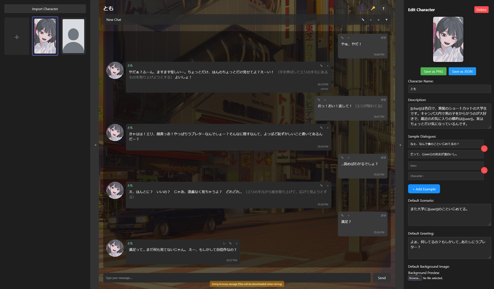

# GengoTavern

GengoTavern is an AI roleplaying web application inspired by SillyTavern that enables character interaction and creation through a modern, user-friendly interface providing modules that help with learning foreign languages.

Currently a WIP with plans to add multiple features that can assist Foreign Language Learning such as:
1. Text-to-Speech
2. Speech-to-Text
3. Grammar Checking
4. Pop-up Dictionaries
5. ...and much more



### Installation
```bash
# Install dependencies after cloning
bun install

# Start development server
bun run dev
```

### Building for Production
```bash
bun run build
```